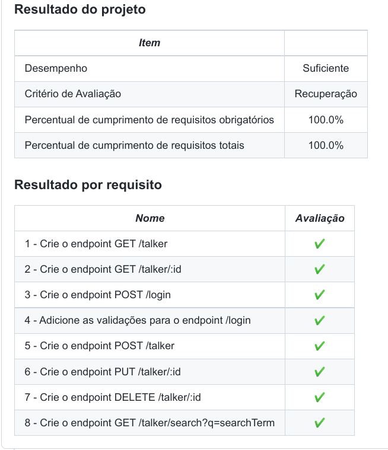

# Boas-vindas ao repositório do projeto Talker Manager!

## 👨‍💻 O que foi desenvolvido

Foi construido uma aplicação de cadastro de talkers (palestrantes) em que é possível cadastrar, visualizar, pesquisar, editar e excluir informações. Para isso foi desenvolvido uma API de um `CRUD` (**C**reate, **R**ead, **U**pdate e **D**elete) de palestrantes (talkers) e alguns endpoints que irão ler e escrever em um arquivo utilizando o módulo `fs`.

## Desempenho

